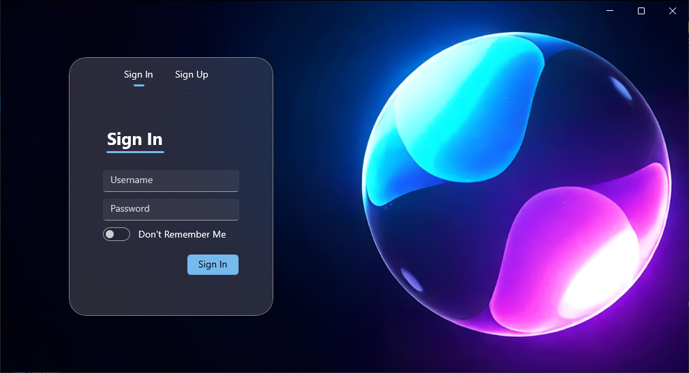
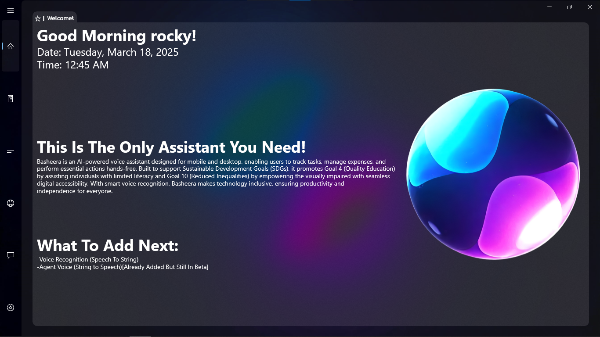
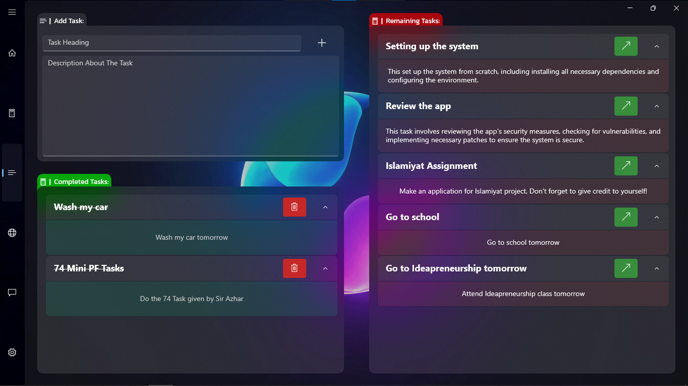
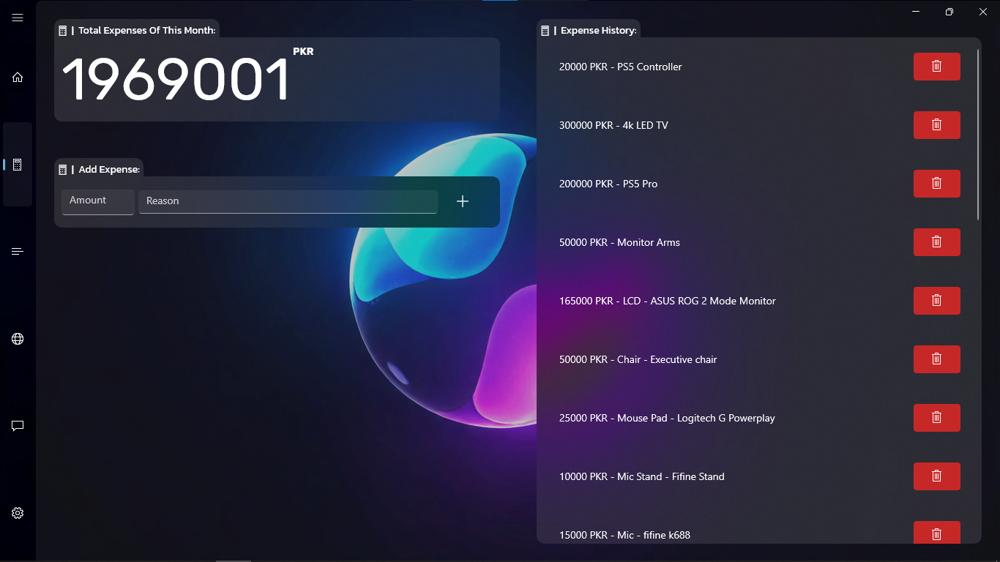
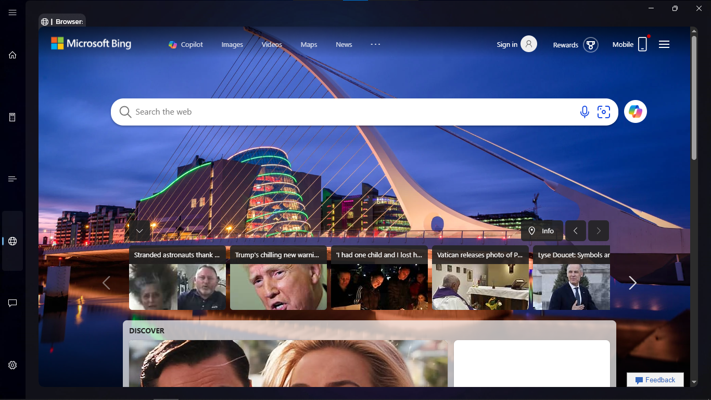
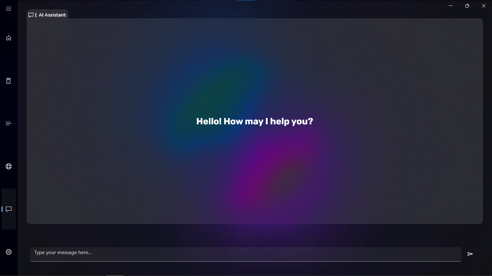

# 🤖 Basheera - AI-Powered Personal Assistant

**Basheera** is an AI-powered desktop assistant built using **WinUI 3** and **C++/WinRT**, integrating the **Gemini API** for natural language processing.

---
## 🧠 Key Feature: AI-Powered Automation  
– Control Everything via Chatbot (ONLY SUPPORTS WITH THE API AND TRAINED MODEL)
Basheera’s **AI chatbot** is the central control hub of the application, allowing users to interact naturally without manual navigation. The chatbot can:  

- ✅ **Manage Tasks** – Add, complete, delete, and organize tasks seamlessly.  
- 💰 **Track Expenses** – Log, categorize, and analyze spending with ease.  
- 🌐 **Control the Built-in Browser** – Open, search, and navigate the WebView2 browser directly from chat.  
- ✍️ **Generate Content** – Write essays, summarize text, and assist with information-based tasks.  
- 🗣️ **Support Local Languages** – Communicate in multiple languages for a personalized experience.  

With **Basheera**, your AI assistant is more than just a chatbot—it's an **intelligent automation tool** that streamlines your workflow and enhances productivity. 🚀  

---

## 🚀 Other Features
- 🔐 **User Authentication** – Secure user registration and login system.
- ✅ **Task Management** – Add, complete, and delete tasks with a simple interface.
- 💰 **Expense Tracking** – Track and manage expenses with categorized entries.
- 📊 **Progress Monitoring** – Visual indicators and progress tracking for tasks.
- 🎨 **Graphical User Interface (GUI)** – Built using **WinRT/WinUI** for a modern experience.
- 🌐 **Web Integration** – Built-in **WebView2** browser for online research.
- 🔊 **Sound & UI Customization** – Interactive sounds and UI customization options.
- 📂 **Data Persistence** – Store user data, tasks, and expenses using **JSON files**.
- ⚠️ **Error Handling & Notifications** – Informative messages for user guidance.
- 🔄 **Responsive Navigation** – Smooth menu navigation for different modules.
- 🔒 **Secure Data Storage** – Ensures user data integrity and privacy. (JSON + BASE64[**CH Manipulation To Avoid Decoding Outside the App!**])
- 🧠 **AI-Powered Chatbot** – Uses **Gemini API** for intelligent responses.

---

## 🛠️ Built With
- **WinUI 3** – Modern Windows UI framework.
- **C++/WinRT** – Standard C++ projection for Windows Runtime.
- **WebView2** – For embedding web content in the app.
- **Gemini API** – AI chatbot integration.
- **WinHTTP** – Handles HTTP requests for API communication.
- **JSON Storage** – Stores user data persistently.
- **BASE 64** – Stores user data securly.

---

## 📅 Strored Data Preview:

```json
    {
        "age": "DbX=\u0000",
        "completedTasks": [
            [
                "FfJxZVmogLWJKvWXNBFyja==\u0000",
                "KU3xkUcmORj5OYKcj7uxM7m7MV9xNwnxX7mdOTY1gUYd\u0000"
            ]
        ],
        "expenseVector": [
            "DbQaDRQxXTiLOE5xXYD6OTFphwKdh7suMBO=\u0000"
        ],
        "loggedIn": false,
        "name": "JVPnkVaxXqYqNBn=\u0000",
        "password": "L7cchwrcMUT=\u0000",
        "totalexpense": "DQ==\u0000",
        "uncompletedTasks": [
            [
            "K73xkU3xLVKmNBWdMV0mkBPfgUmaOIKphV4djq48\u0000",
            "JBK5MV0nOTmnMVYajqCoMBCdj7crjEWbhUYfjdW5h76pjwPpka==\u0000"
            ]
        ],
        "username": "Xq4bg8n=\u0000"
    }
```
---

## 📦 Dependencies
Before building the project, ensure you have:
- **Windows 10/11 SDK** (`10.0.19041.0` or later)
- **Visual Studio 2022** (with **C++/WinRT**, **WinUI 3**, and **WebView2** workloads)
- **Microsoft Edge WebView2 Runtime**
- **Google Gemini API Key** (required for API communication)

### 📥 Install Dependencies with `.vsconfig`
To install all required workloads automatically in **Visual Studio 2022**, follow these steps:

1. Open **Visual Studio Installer**.
2. Click on **Modify** for your **Visual Studio 2022** installation.
3. Click on **More -> Import configuration**.
4. Select the `.vsconfig` file included in this repository.
5. Click **Modify** to install all required components.

### 📦 Install NuGet Dependencies
Run the following command in the project directory:
```sh
nuget restore Basheera.sln
```

---

### 🤖 **AI Integration**
- Add **your actual structure prompt** in the **AI Model Training** section (Gemini AI Studio).
- Replace `"YOUR_API_KEY"`, and `"YOUR_MODEL_NAME"`.

---
# Previews From The App

## 🎥 Preview Video  
Watch the full demo of **Basheera** here:  
[](https://www.youtube.com/watch?v=tndlH-q10DA)  

## 🖥️ Screenshots  
Here are some previews of **Basheera** in action:  

  
*Secure user authentication screen.*  

  
*Home Page.*  

  
*Task management interface for adding, completing, and deleting tasks.*  

  
*Expense tracking module with categorized entries.*  

  
*Browser.*  

  
*AI-powered chatbot interface.*  


---
## 📞 Contact Information  

For any questions, suggestions, or support, feel free to reach out:  

📧 **Email:** [abdulrafaykhalidjameel@gmail.com](mailto:abdulrafaykhalidjameel@gmail.com)  
